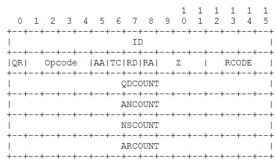
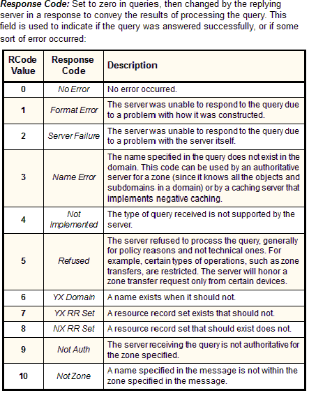
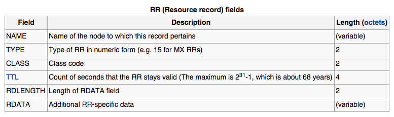

#NOTES
###11 Feb. 2015

###DNS Packet
**Headers**

* **ID**: Should be a random number
* **QR:** Query Response: Set to `0` for a query (asking for IP), set to `1` if the packet is response
* **Opcode:** Type of operation (standard DNS query, etc.): `0` for standard DNS query
* **AA:** Authoritative answer: Answer from source or someone else? Not interesting in purpose of this project
* **TC:** Truncated bit: Marks whether the entire DNS response that the server wanted to send was actually sent (due to packet size limitations). Not really interested (maybe print an error if set)
* **RD:** Recursion desired: Tells local resolver to do all the work and report back to me. (Client should send, DNS Resolver should not send it)
* **RA:** Recursion available bit: Found in responses. Server telling client that it does not support recursion
* **Z:** BLANK (zeroed out)
* **RCODE:** Response code: In response the RCODE will be set to whether there is an error or not and what kind of error. Check this in response to check for unusual conditions
* **QDCOUNT:** Number of questions in packet: Should be **ONE** for both request and response
* **ANCOUNT:** Number of answers in packet: 'Here's the IP for this/here's an alias'. Redirects are NOT in answer count. Answer count > 0 means I finally have an answer. May also have NSCOUNT > 0 even if I have an answer, but I do not need to worry about it.
* **NSCOUNT:** Number of name server records in packet. This is usually a root server telling me to now look at a different one. Number of NS records.
* **ARCOUNT:** Number of additional records in packet. Typically the IP addresses of the name servers from NSCOUNT

**RCODES**

**Records**

* **Question Section:**
    * **name** [variable length]
        * What I'm asking about (ex: `www.google.com`, `name = 3www6google3com0`, where `3`, `6`, `3`, `0` are *binary bytes* denoting the length of the *next* field.
    * **type** [16 bit]
    * **class** [16 bit]

* **Answer Section:**
    * Must parse through question section to figure out where answer question begins due to variable length name
    * **name** [variable length]
    * **type** [16 bit]
    * **class** [16 bit]
    * **ttl** [32 bit]
        * Specifies how long it should be cached for
    * **rdlength** [16 bit]
        * Length of next field (rdata)
    * **rdata**
        * Address record: 4 bytes for IP address
        * CNAME record: Variable length due to alias name of variable length
            * Know length from rdlength, and encoded just like **name** field with binary field separators

**EX:**  
www.google.com -> 3www6google3com0  
nsl.google.com -> 3nsl P^^^^^^^ (pointer to look at different name)

P: If first 2 bits are 1's (if greater than 192 it's a pointer, if less than 192 then it's a length)

Ex: `11 000000 00000001`: Next 6 bits and next byte are a pointer to another location for the rest... since this is `1`, I go to the top of the packet and count down that many records to find the rest of it
